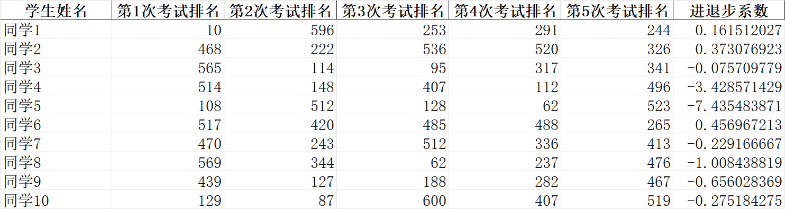
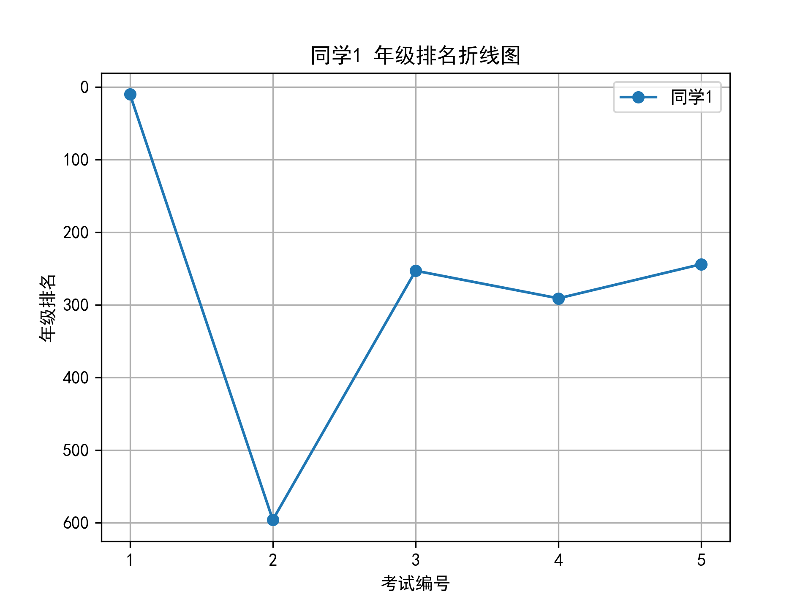
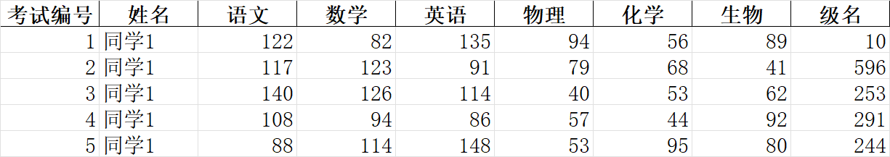

***

# 考试成绩分析工具

***

一个简单的考试成绩分析工具，最新版可以在 [GitHub](https://github.com/fengyec2/ExamAnalysisTool/releases/latest) 或 [Gitee](https://gitee.com/fengyec/ExamAnalysisTool/releases/latest) 下载

您可能会看到：

- 重复造轮子
- 超长方法
- 嵌套条件语句

等等各种高血压写法

## 特性

- [x] **生成进退步系数报表**



- [x] **生成年级排名折线图**



- [x] **生成历次考试成绩单**



## 文件格式

导入的 Excel 文件应**至少**包含以下示例格式：

| 考试编号 | 姓名   | 级名   |
|----------|--------|----------|
| 1        | 张三  | 5        |
| 1        | 李四  | 3        |

| 考试编号 | 姓名   | 级名   |
|----------|--------|----------|
| 2        | 张三  | 4        |
| 2        | 李四  | 2        |

[这里](https://github.com/fengyec2/ExamAnalysisTool/tree/main/assets/example) 提供了一些示例 `.xlsx` 文件

## 更新日志

[更新日志](CHANGELOG.md)

***

## 目录结构

```
.
├── ExamAnalysisTool.py  # 主程序文件
└── README.md            # 本文档
```

## 需求

- Python ≥ 3.6
- 依赖库：
  - pandas
  - matplotlib
  - pyqt5

## 安装依赖

```bash
pip install pandas matplotlib openpyxl PyQt5
```

## 自行构建

安装 PyInstaller：

```bash
pip install pyinstaller
```

```bash
pyinstaller --onefile --windowed --hidden-import matplotlib.backends.backend_pdf ExamAnalysisTool.py
```

## 使用说明

1. **运行程序**：

   ```bash
   python ExamAnalysisTool.py
   ```

2. **选择文件**：选择一个或多个包含成绩数据的 Excel 文件。文件要求至少包含以下列：
   - `考试编号`
   - `姓名`
   - `级名`

## 注意事项

- 请确保 Excel 文件的格式正确

## 清单

- [ ] 生成成绩分析幻灯片
- [x] 支持文件拖拽添加
- [ ] 使用线程池处理任务
- [x] 去重复造轮子
- [x] 支持输出不同格式图表

## 许可证

本项目采用 GPL-3.0 许可证，详细信息请查看 [LICENSE](LICENSE) 文件

***